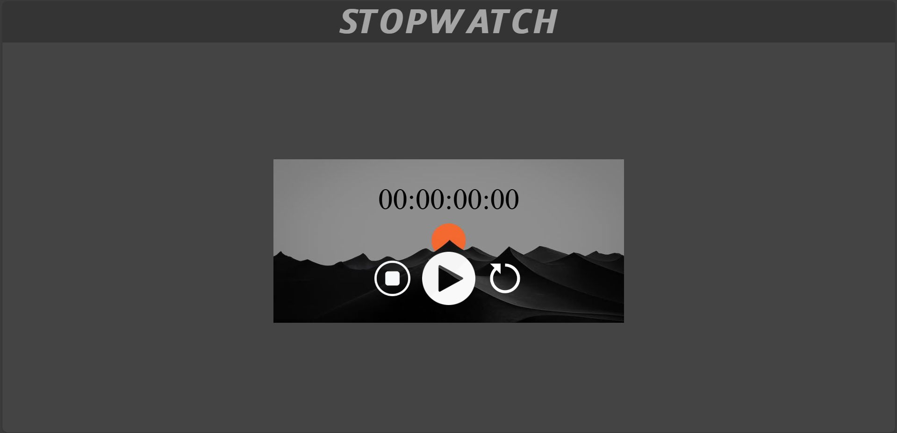

# ⏱️ Stopwatch Web App

A clean, functional, and lightweight stopwatch built using **HTML**, **CSS**, and **JavaScript**. Designed to track time accurately with Start, Pause, and Reset functionality — perfect for workouts, coding sessions, or productivity tracking.

## 🚀 Live Demo

🔗 [View the Stopwatch Live](https://shashank1220.github.io/STOPWATCH/)

---

## 🧩 Features

- ✅ Start / Pause / Reset timer
- ✅ Millisecond precision
- ✅ Minimalist and responsive UI
- ✅ Lightweight with no external libraries

---

## 💻 Technologies Used

- **HTML5** – Structure
- **CSS3** – Styling and layout
- **JavaScript (ES6)** – Stopwatch logic and interactivity

---

## 📸 Screenshots

---

## 📁 Project Structure

📦 STOPWATCH/
┣ 📜 Stopwatch.html
┣ 📜 Stopwatch.css
┗ 📜 Stopwatch.js

---

##  🌱 Future Goals & Improvements
Here are some ideas planned for future releases:
<ul>
<li>⏳ Lap Timer – Add functionality to record laps/splits.</li>
<li>🎨 Theme Toggle – Dark/light mode support.</li>
<li>📱 Mobile Enhancements – Improve touch interactions and responsiveness.</li>
<li>💾 Persistent Timer – Keep timer running in background using localStorage or Service Workers.</li>
<li>🕐 Animated UI Elements – Smooth transitions and animations.</li>
<li>📊 Time Statistics – Store and visualize time logs.</li>
</ul>

Feel free to contribute if you'd like to help build out these features!

##  🤝 Contributing
    Contributions are welcome! If you have suggestions or improvements, feel free to fork the repo and submit a pull request.

##  📄 License
    This project is licensed under the MIT License.

##  👤 Author
    Made by SHASHANK PANDEY